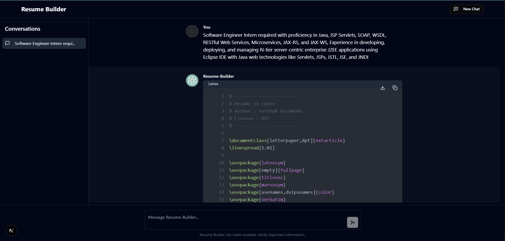
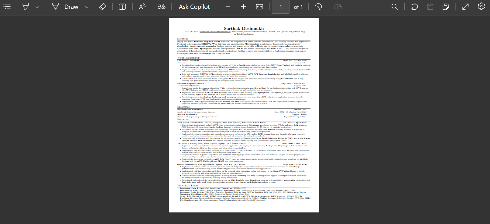

# Resume Builder Bot

A modern, AI-powered resume and cover letter builder that leverages Google Gemini (gemini-2.5-flash), Next.js, Node.js, and shadcn/ui for a seamless user experience. Generate tailored LaTeX resumes and cover letters optimized for ATS, with support for PDF export and advanced customization.

---

## Table of Contents

- [Resume Builder Bot](#resume-builder-bot)
  - [Table of Contents](#table-of-contents)
  - [Features](#features)
  - [Tech Stack](#tech-stack)
  - [Architecture Overview](#architecture-overview)
  - [Screenshots](#screenshots)
  - [Getting Started](#getting-started)
    - [Prerequisites](#prerequisites)
    - [Installation](#installation)
    - [Environment Variables](#environment-variables)
    - [Running the App](#running-the-app)
  - [Usage](#usage)
  - [Project Structure](#project-structure)
  - [Customization](#customization)
  - [Troubleshooting](#troubleshooting)

---

## Features

- **AI-Powered Resume Generation:** Uses Google Gemini to generate highly relevant, ATS-optimized LaTeX resumes and Markdown cover letters based on your job description and master template.
- **Modern UI:** Built with Next.js, TailwindCSS, and shadcn/ui for a responsive, accessible, and beautiful interface.
- **Multi-Format Support:** Handles LaTeX, Markdown, code blocks, and plain text.
- **PDF Export:** Instantly convert LaTeX resumes to PDF via the backend.
- **Conversation Management:** Save, switch, and delete multiple resume-building sessions.
- **Dark/Light Mode:** Toggle between themes for comfortable viewing.
- **Mobile Responsive:** Fully optimized for all device sizes.
- **Local Storage:** Conversations and settings are saved in your browser.
- **Secure:** No sensitive data is stored on the server; all processing is session-based.
- **Easy Customization:** Edit the master LaTeX template and prompt logic for your needs.

---

## Tech Stack

- **Frontend:** Next.js (App Router), TypeScript, TailwindCSS, shadcn/ui, React Markdown, React KaTeX, React Syntax Highlighter
- **Backend:** Node.js, Express, Google Generative AI (Gemini), node-latex
- **PDF Generation:** LaTeX to PDF via node-latex and pdflatex
- **Other:** dotenv, Radix UI, localStorage

---

## Architecture Overview

```
[User] 
   │
   ▼
[Next.js Frontend]  ←→  [Node.js/Express Backend]  ←→  [Google Gemini API]
   │                                 │
   │                                 └──> [LaTeX → PDF (node-latex, pdflatex)]
   │
   └──> [PDF Download]
```

- The frontend collects user input (job description, etc.) and communicates with the backend.
- The backend generates a prompt, sends it to Gemini, and returns the AI-generated LaTeX resume and cover letter.
- The backend can also convert LaTeX to PDF and stream it back to the user.

---

## Screenshots

- 
- 

---

## Getting Started

### Prerequisites

- **Node.js** v16 or higher
- **npm** or **bun** (for frontend)
- **pdflatex** (for PDF export; install TeX Live or MikTeX)
- **Google Gemini API Key** (see below)

### Installation

1. **Clone the repository:**
   ```sh
   git clone https://github.com/sarthak-deshmukh1999/resumebuilderbot.git
   cd resumebuilderbot
   ```

2. **Install root dependencies:**
   ```sh
   npm install
   ```

3. **Install client dependencies:**
   ```sh
   cd client
   npm install
   cd ..
   ```

4. **Install server dependencies:**
   ```sh
   cd server
   npm install
   cd ..
   ```

### Environment Variables

1. **Google Gemini API Key:**
   - Go to [Google Cloud Console](https://console.cloud.google.com/)
   - Enable Gemini API
   - Generate an API key

2. **Configure the backend:**
   - Create a `.env` file in the `server` directory:
     ```
     GEMINI_API_KEY=your-gemini-api-key-here
     PORT=8080
     ```
   - Alternatively, you can use `config.js` (see code comments), but `.env` is recommended.

3. **Ensure `pdflatex` is installed and in your PATH** for PDF export:
   - **Ubuntu:** `sudo apt-get install texlive-full`
   - **Windows:** Install [MiKTeX](https://miktex.org/) and add to PATH

### Running the App

From the root directory:

```sh
# Start the backend server
cd server
npm start
# or
node server.js
```

In a new terminal:

```sh
# Start the frontend
cd client
npm run dev
```

- Open your browser at [http://localhost:3000](http://localhost:3000)

---

## Usage

1. **Enter a job description** and start a new conversation.
2. **Review the AI-generated LaTeX resume and cover letter.**
3. **Download as PDF** or copy the LaTeX/Markdown as needed.
4. **Switch between conversations** or start a new one for a different job.

---

## Project Structure

```
resumebuilderbot/
│
├── client/                # Next.js frontend
│   ├── src/
│   │   ├── app/           # Next.js app routes
│   │   ├── components/    # UI components (chat, sheet, scroll-area, etc.)
│   │   ├── context/       # React context providers
│   │   ├── lib/           # Utility functions
│   │   └── types/         # TypeScript types
│   ├── public/            # Static assets
│   ├── tailwind.config.ts
│   └── ...
│
├── server/                # Node.js backend
│   ├── server.js          # Express server
│   ├── recommendationPrompt.js # Prompt generation logic
│   ├── main.txt           # Master LaTeX resume template
│   └── ...
│
├── README.md              # Project documentation
└── ...
```

---

## Customization

- **LaTeX Template:** Edit `server/main.txt` to change the master resume format.
- **Prompt Logic:** Edit `server/recommendationPrompt.js` to tweak how the AI is instructed.
- **Frontend UI:** Customize components in `client/src/components/` and styles in `client/src/app/globals.css`.

---

## Troubleshooting

- **PDF Export Fails:** Ensure `pdflatex` is installed and available in your system PATH.
- **Gemini API Errors:** Check your API key and Google Cloud billing status.
- **